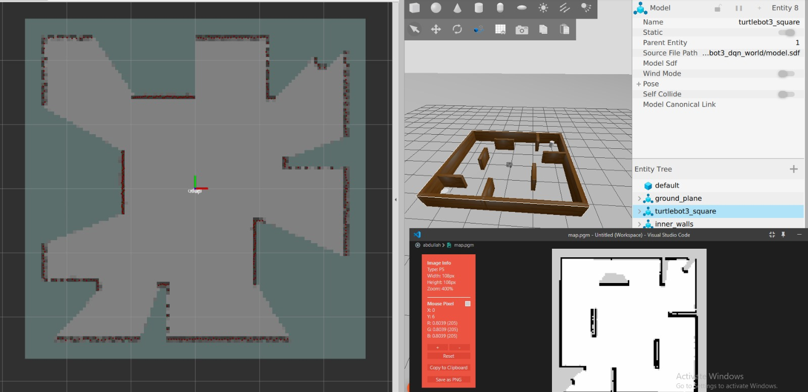
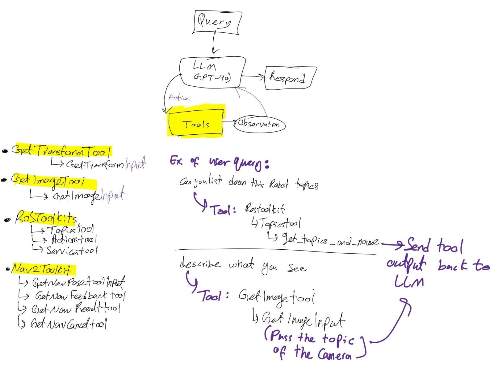
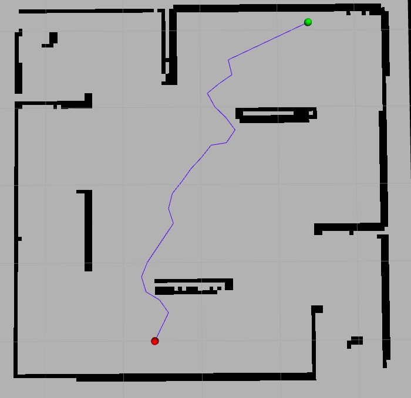

# Take-Home Assignment
**Abdullah Al-Shateri**

## Table of Contents
1. [Project Overview](#project-overview)
2. [Prerequisites](#prerequisites)
3. [Section 1: Exploration and SLAM](#section-1-exploration-and-slam)
4. [Section 2: Robot Agent with Navigation](#section-2-robot-agent-with-navigation)
5. [Section 3: RRT Path Planner](#section-3-rrt-path-planner)
6. [Troubleshooting](#troubleshooting)
7. [References](#references)

## Project Overview

This project demonstrates three key robotics capabilities using TurtleBot3 in ROS 2:
- **SLAM and Exploration**: Simultaneous Localization and Mapping using Cartographer
- **Intelligent Robot Agent**: Natural language control via RAI framework with OpenAI integration
- **Path Planning**: RRT (Rapidly-exploring Random Tree) algorithm visualization

## Prerequisites

**Software Requirements:**
- ROS 2 Jazzy (or compatible distribution)
- TurtleBot3 packages (gazebo, cartographer, navigation2)
- OpenAI API key for robot agent functionality
- Poetry (for RAI framework dependencies)

**Workspace Structure:**
```
project/
├── dev_ws/          # Main ROS 2 workspace
└── rai/             # RAI framework for robot agent
```

**Essential Setup:**
```bash
export TURTLEBOT3_MODEL=waffle_pi
```
*Note: This export must be run in every terminal session or you should consider adding it to bashrc.* 

## Section 1: Exploration and SLAM

Build maps using Cartographer SLAM with manual teleoperation control.

### Terminal Setup

**Terminal A - Launch Gazebo Environment:**
```bash
cd dev_ws
colcon build --symlink-install
source install/setup.bash
export TURTLEBOT3_MODEL=waffle_pi
ros2 launch turtlebot3_gazebo turtlebot3_dqn_stage4.launch.py
```

**Terminal B - Start SLAM:**
```bash
cd dev_ws
source install/setup.bash
export TURTLEBOT3_MODEL=waffle_pi
ros2 launch turtlebot3_cartographer cartographer.launch.py use_sim_time:=true
```

**Terminal C - Manual Control:**
```bash
cd dev_ws
source install/setup.bash
export TURTLEBOT3_MODEL=waffle_pi
ros2 run turtlebot3_teleop teleop_keyboard
```

### Usage
Drive the robot around using keyboard controls to build the map. Save your map when complete:
```bash
ros2 run nav2_map_server map_saver_cli -f ~/map
```



## Section 2: Robot Agent with Navigation

Control TurtleBot3 through natural language commands using the RAI framework.

### Terminal Setup

**Terminal A - Launch RAI Agent Interface:**
```bash
cd rai
colcon build --symlink-install
source ./setup_shell.sh
export OPENAI_API_KEY=YOUR_OPENAI_KEY
poetry run streamlit run src/scripts/turtlebot3_agent.py
```
*Access the web interface at the localhost URL provided by Streamlit.*

> The core integration between the Large Language Model and ROS happens in [`rai/src`](rai/src). This is where the AI agent processes natural language commands and translates them into ROS actions using state classes and tools from the RAI framework.

**Terminal B - Gazebo Environment:**
```bash
cd dev_ws
source install/setup.bash
export TURTLEBOT3_MODEL=waffle_pi
ros2 launch turtlebot3_gazebo turtlebot3_dqn_stage4.launch.py
```

**Terminal C - Navigation Stack:**
```bash
cd dev_ws
source install/setup.bash
export TURTLEBOT3_MODEL=waffle_pi
ros2 launch turtlebot3_navigation2 navigation2.launch.py use_sim_time:=true map:=$MAP_PATH
```

### Usage
Interact with your robot through the Streamlit interface using natural language commands like "move to the kitchen" or "rotate 90 degrees."


**Agent Workflow Architecture:**



## Section 3: RRT Path Planner

Visualize RRT (Rapidly-exploring Random Tree) path planning algorithm in RViz.

### Terminal Setup

**Terminal A - Launch RViz:**
```bash
cd dev_ws
source install/setup.bash
rviz2 -d dev_ws/src/rrt/config/rviz_config.rviz
```

**Terminal B - Start RRT Node:**
```bash
cd dev_ws
source install/setup.bash
ros2 run rrt rrt
```

### Expected Output
The RViz interface will display the RRT algorithm building a path tree in real-time.



## Troubleshooting

### Common Issues and Solutions

**Environment Setup:**
- Source the workspace in every new terminal: `source install/setup.bash`
- Always set the TurtleBot3 model: `export TURTLEBOT3_MODEL=waffle_pi`
- Use simulation time for Gazebo: `use_sim_time:=true`

**ROS 2 Installation:**
- Source ROS 2 setup if commands are not found: `source /opt/ros/$ROS_DISTRO/setup.bash`
- Verify all required packages are installed

**RAI Framework:**
- Install Poetry if not available: [Installation](https://robotecai.github.io/rai/setup/install/)
- Ensure valid OpenAI API key is set [Setup](https://robotecai.github.io/rai/setup/vendors/)
- Check network connectivity for API calls

## References

- [TurtleBot3 Simulation Manual](https://emanual.robotis.com/docs/en/platform/turtlebot3/simulation/) - ROBOTIS e-Manual
- [RAI Framework](https://github.com/RobotecAI/rai) - RobotecAI Repository
